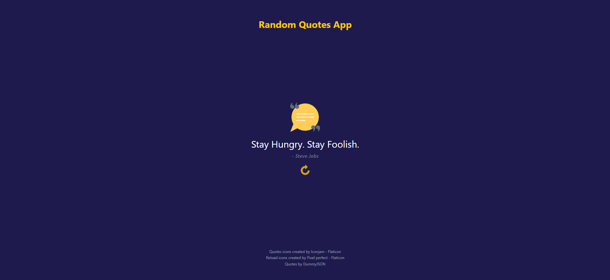
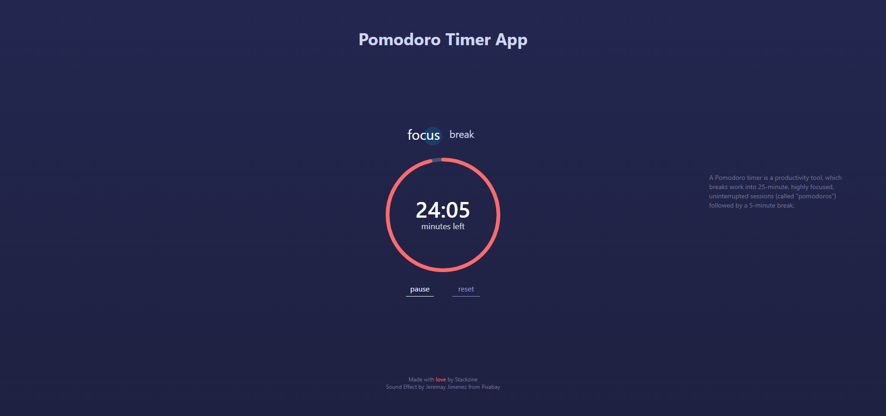

# 5 Simple React Projects
Simple React projects to learn React concepts.

## 01. Random Quote Generator App

An app with beautiful UI that generates random quotes.

### What You will Learn?
- Bootstrap React project with Vite
- Use Tailwind CSS
- Accessiblity
- Unit test using Vitest and React Testing Library

### Screenshot

---

## 02. Pomodoro Timer App

A simple and responsive implementation of a Pomodoro Timer App with an alarm when the timer finishes. You'll also learn how to create fancy buttons with animations.

### What concepts we have used in this app?
- We are using Vite to bootstrap our project
- We are also using Tailwind CSS for styling
- We are using Vitest and RTL for component testing - here you'll be able to see how we are testing timers like `setInterval()` and and `setTimeout()` using `vi.useFakeTimers()`
- We have also added accessibility features like semantic HTML, `aria-label` at proper places, and there descriptions

### Screenshots

